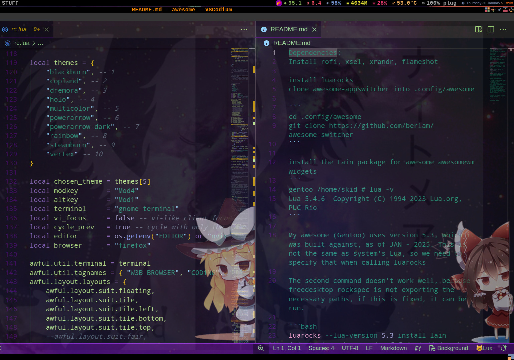
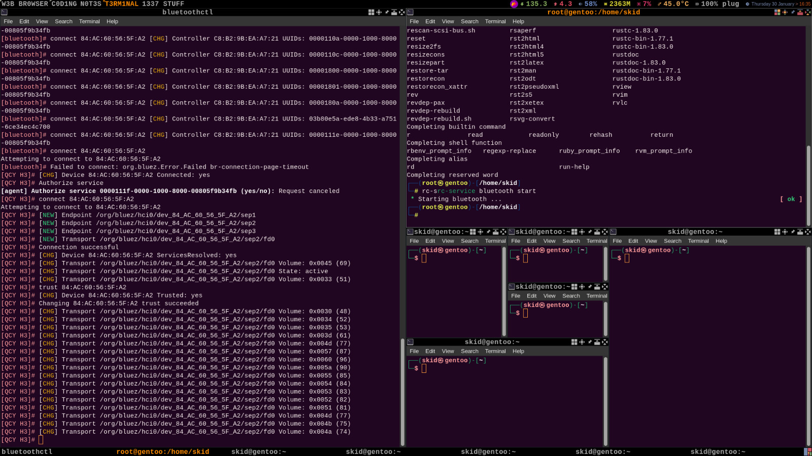
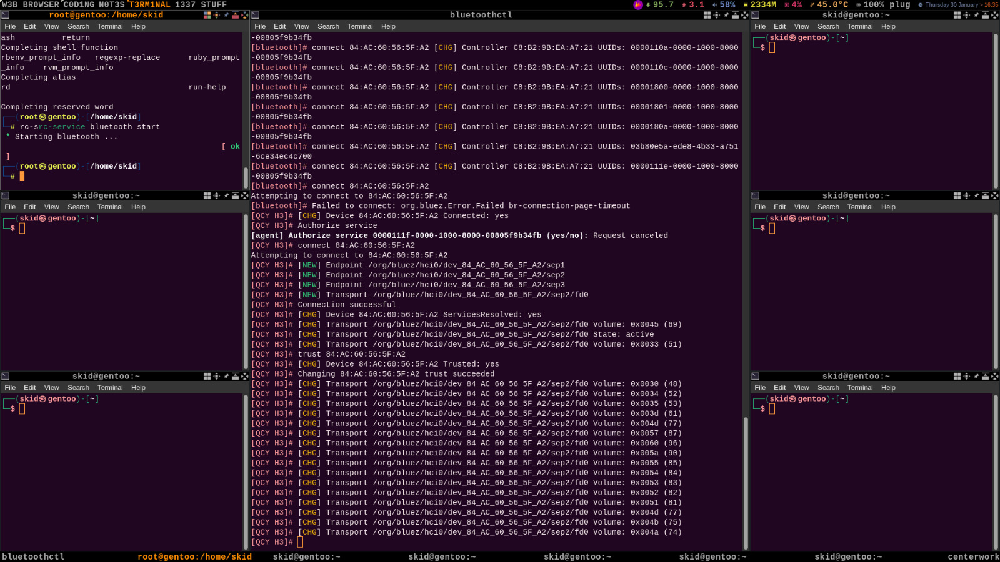
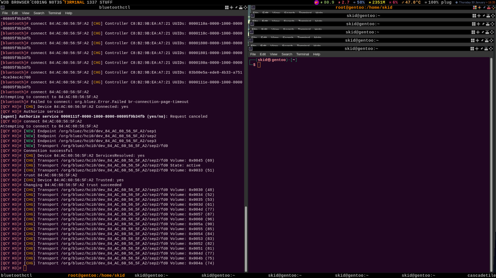
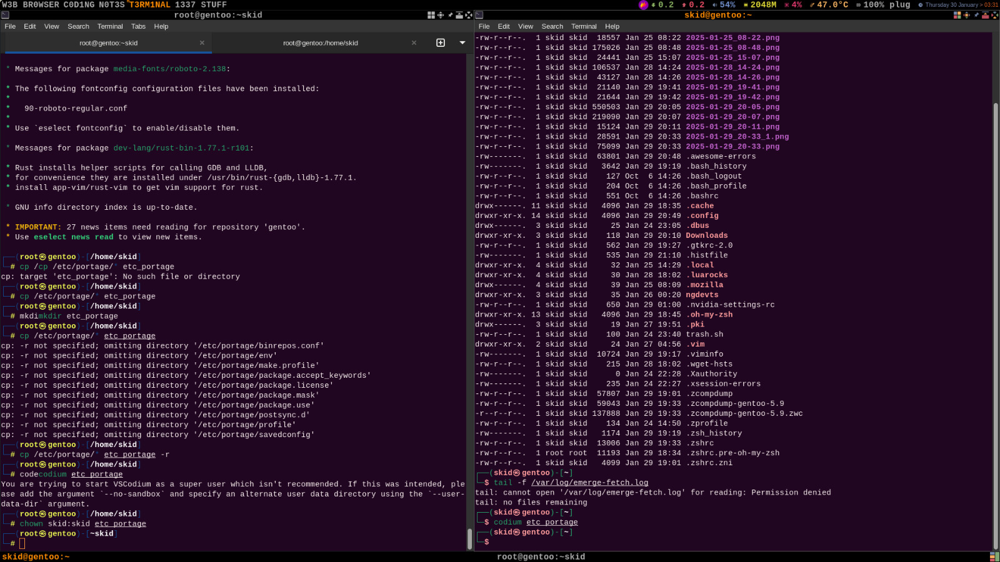

Dependencies:
Install rofi, xsel, xrandr, flameshot

install luarocks
clone awesome-appswitcher into .config/awesome

```
cd .config/awesome
git clone https://github.com/berlam/awesome-switcher
```

install the Lain package for awesome awesomewm widgets
```
gentoo /home/skid # lua -v
Lua 5.4.6  Copyright (C) 1994-2023 Lua.org, PUC-Rio
```

My awesome (Gentoo) uses version 5.3, which it was built against, as of JAN - 2025. This is not the same as system's Lua, so we need to specify that when calling luarocks

The second command doesn't work well, because freedesktop rockspec is not exporting the necessary paths, if this is fixed, it can be run.

```bash
luarocks --lua-version 5.3 install lain
# luarocks --lua-version 5.3 install lcpz/awesome-freedesktop 
```

```bash
luarocks --lua-version 5.3 install https://raw.githubusercontent.com/cabra-lat/awesome-freedesktop/refs/heads/patch-1/awesome-freedesktop-scm-1.rockspec
```


Daemons: It works for kali and gentoo, but a few things are executed at startup:

- Flameshot for screenshots;
- Wireplumber for sound (it is needed for sddm, other dms might not need it);
- NetworkManager for wifi;
- volumeicon for music;
- xiccd for color correction (colord).

Autorun idea stolen from https://wiki.archlinux.org/title/Awesome

LuaJit should be way faster, but it wasn't built to support Lua 5.3, the developer disagrees heavily on it. There is another luajit that should support newer lua implementations, but it hasn't been built and tested with awesome. Lain depends on lua 5.3, same thing with awesome-freedesktop, we can't have luajit or both of these options, I choose to stick with lua 5.3 because I think lain themes are really badass.

Security:

For security, chown the awesome directory to root:root, so that no malware can be persistent if it gets access to it.
```
chown -R root:root ${HOME}/.config/awesome
```

Set everything for darktheme
use lxappearance and qt5ct


